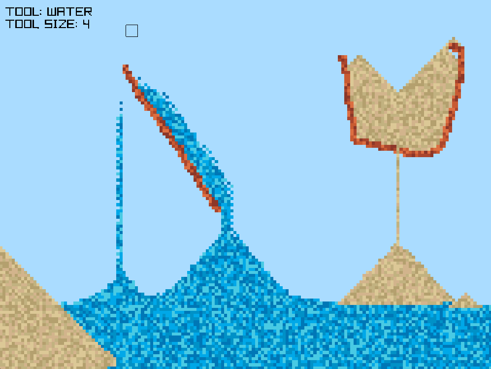

# cShore

A really basic beach themed cellular automaton featuring sand, water and other elements, written in C & Raylib.

## Screenshot



## Controls

- `MOUSE SCROLL WHEEL`        : Used to change currently selected particle type.
- `CTRL + MOUSE SCROLL WHEEL` : Used to change the marker size.
- `LEFT MOUSE BUTTON`         : Used to draw the current particle.
- `RIGHT MOUSE BUTTON`        : Pause / Resume simulation.
- `CTRL + L`                  : Delete all particles at once.    

## Build

- You'd need a `c compiler`, `meson`, `ninja` and `cmake` (To build Raylib).
- `Raylib` is provided as a git submodule.

```bash
git clone --recursive https://github.com/tmpstpdwn/cShore
cd cShore
meson setup build --buildtype=release
meson compile -C build
```

## Run

```bash
./build/cShore
```

## LICENSE

[MIT LICENSE](LICENSE)
